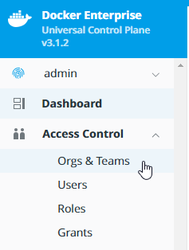
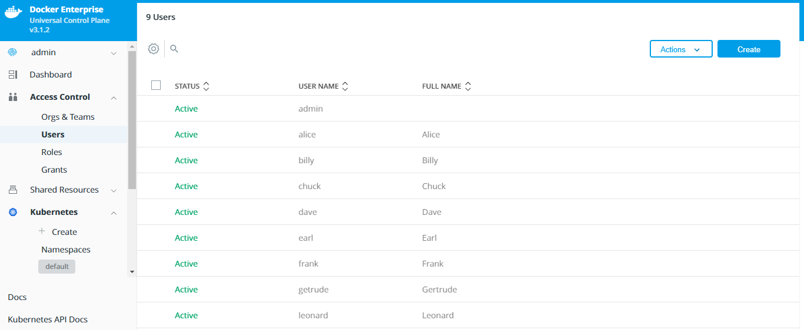

# Create a simple RBAC structure

By the end of this exercise, you should be able to:

 - Create a simple RBAC structure within UCP
 - Understand the relations between Organisations, Teams and Users

## Part 1 - Organizations

In each part we will create one piece of the RBAC structure. We will start with **Organizations**

1. Log into your UCP installation with an admin user, e.g. `admin`

/

2. Select your `Access Control` and `Orgs & Teams`

/

3. Select the `Create`Button and create the following Teams:

- developers

- devops

The result should reflect this:
/

## Part 2 - Teams

In this part we will create the **Teams**

1. Still in `Orgs & Teams` select the Organization `developers`

2. Click the **+** in the upper right corner to add a new team and call it `alpha`. Click `Create`to complete the first team.

3. Repeat the steps with a second team called `beta`

The result should reflect this:
/

4. Repeat step 2. and 3. with the Organization `devops`. The teams should be named `members` and `sensitive`

The result should reflect this:
/

## Part 3 - Users

In this part we will create the **Users** and assign them to their **Teams**

1. Select your `Access Control` and `Users`

2. Select the `Create`Button and create the following Users:

- alice
- billy
- chuck
- dave
- earl
- frank
- gertrude
- leonard

The result should reflect this:
/

3. Switch to `Orgs & Teams` and select the Organization `developers`. Assign the users to the following Teams by clicking the upper right **+**:

- alpha: alice, billy, leonard
- beta: chuck, dave, leonard

4. Switch to `Orgs & Teams` and select the Organization `devops`. Assign the users to the following Teams by clicking the upper right **+**:

- members: earl, frank, gertrude
- sensitive: gertrude

...

## Conclusion

In addition to summarizing the exercise, this is your opportunity to provide some broader context for what just happened; what are some topics for further study? Where does this fit into the bigger picture of the story we're telling in this workshop?
