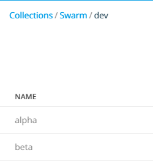
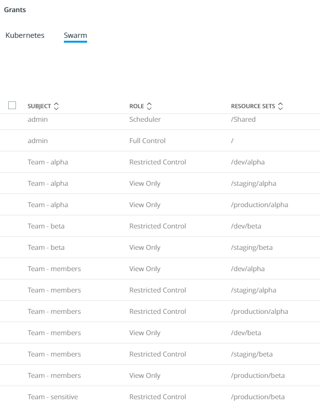
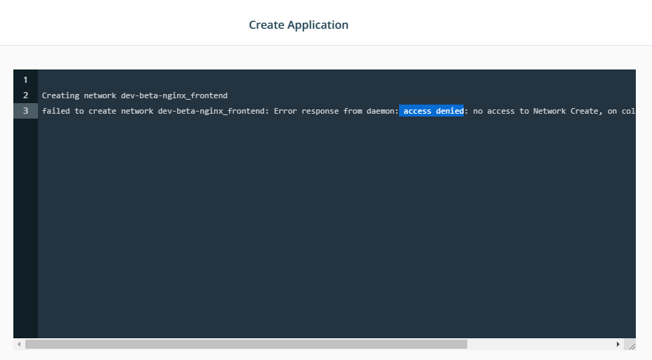

# Create a simple RBAC structure

By the end of this exercise, you should be able to:

 - Create a simple RBAC structure within UCP
 - Understand the relations between Organisations, Teams and Users

## Part 1 - Organizations

In each part we will create one piece of the RBAC structure. We will start with **Organizations**

1. Log into your UCP installation with an admin user, e.g. `admin`

/


2. Select your `Access Control` and `Orgs & Teams`

/


3. Select the `Create`Button and create the following Teams:

- developers

- devops

The result should reflect this:
/


## Part 2 - Teams

In this part we will create the **Teams**

1. Still in `Orgs & Teams` select the Organization `developers`

2. Click the **+** in the upper right corner to add a new team and call it `alpha`. Click `Create`to complete the first team.

3. Repeat the steps with a second team called `beta`

The result should reflect this:
/

4. Repeat step 2. and 3. with the Organization `devops`. The teams should be named `members` and `sensitive`

The result should reflect this:
/


## Part 3 - Users

In this part we will create the **Users** and assign them to their **Teams**

1. Select your `Access Control` and `Users`

2. Select the `Create`Button and create the following Users:

- alice
- billy
- chuck
- dave
- earl
- frank
- gertrude
- leonard

The result should reflect this:
/

3. Switch to `Orgs & Teams` and select the Organization `developers`. Assign the users to the following Teams by clicking the upper right **+**:

- alpha: alice, billy, leonard
- beta: chuck, dave, leonard

4. Switch to `Orgs & Teams` and select the Organization `devops`. Assign the users to the following Teams by clicking the upper right **+**:

- members: earl, frank, gertrude
- sensitive: gertrude


## Part 4 - Create Collections

We want our cluster to be split into three parts: `dev`, `staging`, `production`. Therefor we need to create **collections** to create a virtual possability to seperate our cluster.

1. Select your `Shared Resources` and `Collections`

2. Select `View Children` on the default collection `Swarm`

3. Select `Create Collection` and provide the name `dev`

4. Repeat step 3. for collection `staging` and `production`

The result should reflect this:
/

5. Select `View Children` on the `dev`collection.

6. Select `Create Collection` and provide the name `alpha`

7. Repeat step 5. - 6. to create the following collections:

```
dev/alpha
dev/beta
staging/alpha
staging/beta
production/alpha
production/beta
```
The result for each parent collection should reflect this:

/


## Part 5 - Role assignment

As we have a simple RBAC structure now, we need to grant the Teams their respective management rights.

1. Select your `Access Control` and `Grants`

2. Select `Swarm` at the top of the Grants page

3. Select `Create Grant` and provide the following details:
- Organizations -> Organizations: `developers` -> Team(Optional) -> `alpha` abd click `NEXT`
- Resource Set -> `View Children` on Swarm -> `View Children` on dev -> select collection `alpha`
- Role -> Select `Restricted Control` and `Create`

4. Repeat step 3. to apply the following table to your Teams and Collections:

/

5. Delete the grant `Org - docker-datacenter // Role: Scheduler`. This rule will cause anyone within the current setup to be able to schedule within the cluster. As we want restricted access to our cluster, this rule must be deleted.

The result for each parent collection should reflect this:

/


## Part 6 - Testing the RBAC model

We will be using the following Stack to test our deployment:

```
version: '3.1'

services:
  demodocker:
    image: nginx:alpine
    environment:
      - DOMAIN=test.ucp.local
    ports:
      - 8880:80
      - 8443:443
    networks:
      - frontend
    volumes:
      - static_content:/var/www/html:ro
    deploy:
      mode: replicated
      replicas: 1
      resources:
        limits:
          memory: 1G
      labels:
        - com.docker.ucp.access.label=/dev/alpha

networks:
  frontend:
    labels:
      - com.docker.ucp.access.label=/dev/alpha

volumes:
  static_content:
    labels:
      - com.docker.ucp.access.label=/dev/alpha
```


1. Log out from UCP and log in with the user `alice`

2. Select `Shared Resources` and select `Stacks`

3. Select `Create Stack` in the upper right corner.

4. Provide a Application name, e.g. `dev-alpha-nginx`, select Orchestrator Mode `SWARM`, Application File Mode `COMPOSE FILE` and click `NEXT`

5. Copy and paste the stack file example into the docker-compose.yml Field or upload the .yml file and click `NEXT`. The stack **should be deployable without any issues**.

6. Repeat step 4. and 5. - Before you apply the COMPOSE FILE change the labels to match `/dev/beta` - You will receive an error: `access denied: no access to Network Create, on collection b1d4b10a-c949-410b-b084-6cf61ec1576d`


/


## Conclusion

UCP allows us with only a few steps to provide a RBAC module to apply to your environment. RBAC structures depend on initial planing. It is mandetory to know the "Who is Who" of the users of UCP.

Further reading: https://success.docker.com/article/rbac-example-overview
