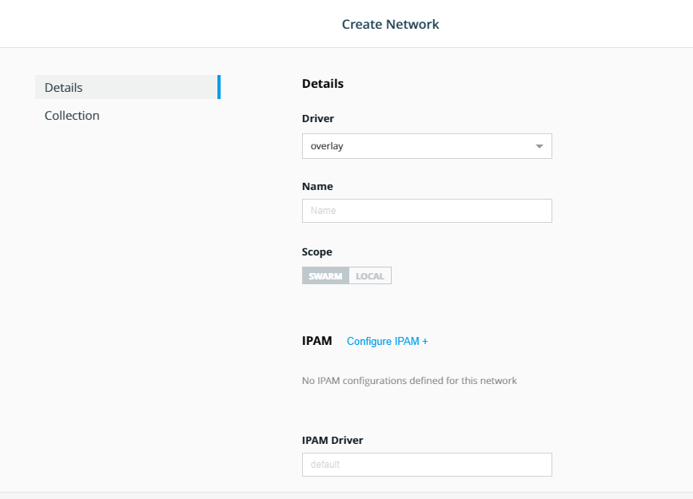
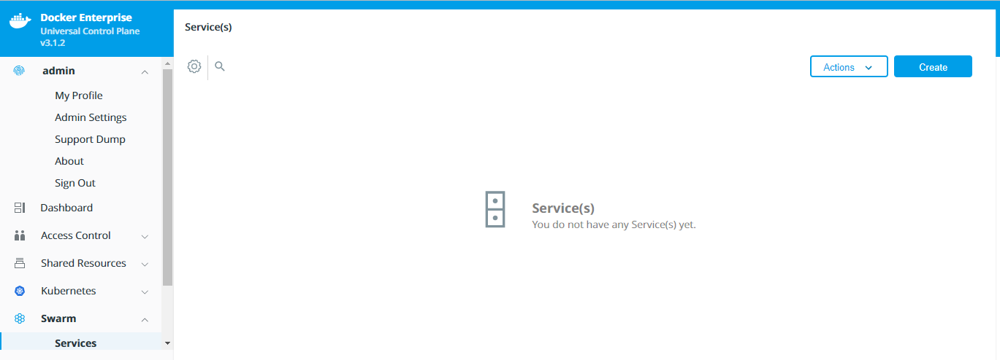
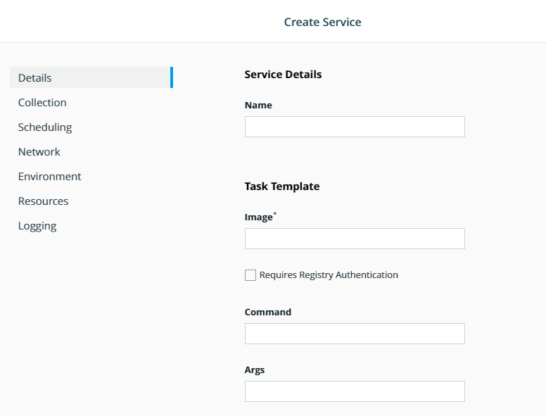
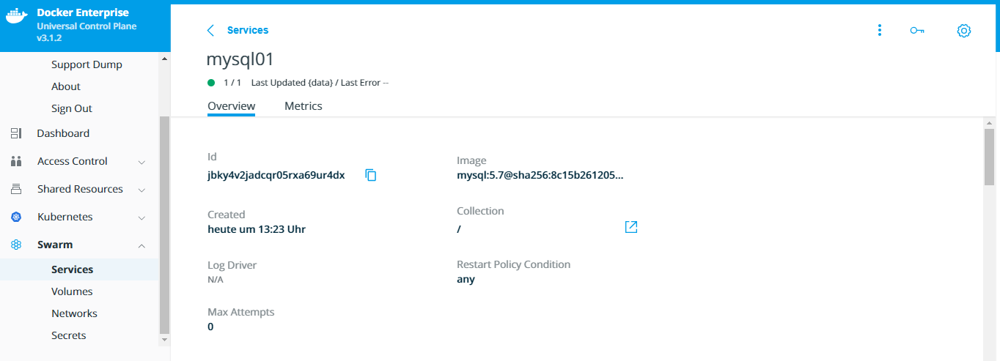

# Deploy a multi-service app with UCP

By the end of this exercise, you should be able to:

 - Use UCP Web UI to deploy services
 - Change service and object attributes after a service has been deployed

## Part 1 - Deploy a MYSQL Database

Our multi-service app will use a WORDPRESS Frontend and MYSQL Database as backend. We will start by providing the MYSQL database

1. Log into your UCP installation with an admin user, e.g. `admin`

/

## Part 2 - Preparations - Create a network

1. Select `Swarm` and select `Networks`. Click the `Create` button on the upper right side.

2. Fill in the following information:

/

Details:
- Driver: overlay
- Name: backend

3. Repeat 2. with the following informations:

Details:
- Driver: overlay
- Name: frontend

## Part 3 - Service creation

Instead of running a YML file through the CLI, we will create our Service by using the Web UI Wizard. We will supply the YML by the end of this exercise.

1. Select `Swarm` and select `Service`. Click the `Create` button on the upper right side.

/

2. Within the Wizard fill in the following informations:

/

Details
- Name: mysql01
- Image mysql:5.7

Collection
- No changes/defaults

Scheduling
- No changes/defaults

Network
- Mode: DNS RR
- Networks: backend

Environment:
- Environment Variable:
    - MYSQL_ROOT_PASSWORD=ThisIsSecret
    - MYSQL_DATABASE=wordpress
    - MYSQL_USER=wordpress
    - MYSQL_PASSWORD=ThisIsAlsoSecret

Resources
- Add Volume: 
    - New
    - Source: db_data
    - Target: /var/lib/mysql

Logging
- No changes/defaults

When done click `Create`. Your mysql01 Service should be available in a few seconds.

/

## Conclusion

With the LDAP connection you can mirror your existing user strucktures to UCP. This allows you to keep current structures and makes user management easier.

Further reading: https://docs.docker.com/ee/ucp/admin/configure/external-auth/
