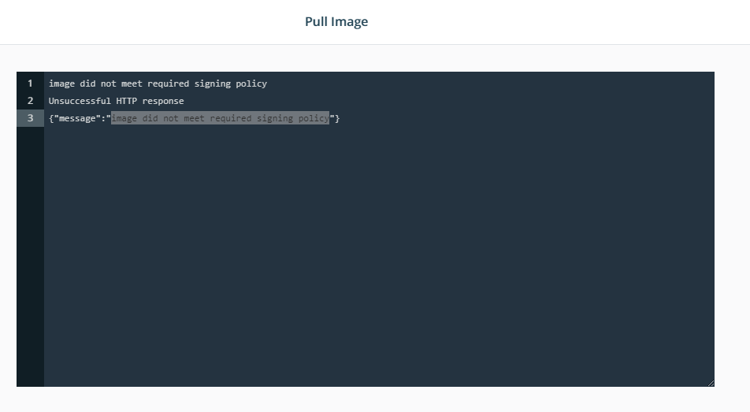

# Docker Content Trust

By the end of this exercise, you should be able to:

 - Sign an image
 - Configure Docker Content Trust in UCP
 - allow only signed containers to be run on UCP
 
 

## Part 1 - Pre-Requisits

You should have ran through the following exercises:

https://github.com/stefantrimborn/workshop-pe/blob/master/exercises/part02-general-ssl-certificates.md
https://github.com/stefantrimborn/workshop-pe/blob/master/exercises/part02-ucp-rbac-structure.md 
https://github.com/stefantrimborn/workshop-pe/blob/master/exercises/part02-dtr-repository-rbac.md


Our user Alice from Team Alpha would like to make sure her image is signed. Additionally the DevOps Team has announced that only signed images are supposed to be scheduleable within UCP.

We will create a new Repository under the user Alice and sign the image. DevOps will go ahead and test with Alice container the DCT features in UCP.

## Part 2 - Create the repositories

You can decide if you want to create the repositories by each user or if you create them by your admin user. We will go ahead and user the admin user.

### Alice

1. Click `Repositories` then `New Repositories` and then select the user `alice`. Give the repository the name `trusted` and make it `Public`.

/


## Part 2 Sign an image and upload it to DTR

We will use an Docker Hub provided image in this example.

1. Download Alice Client bundle by logging into UCP with alice credentials, select her username and within `My Profile` create a `New Client Bundle`.

2. Transfer the client bundle to your workstation.

3. Prepare your signatures and keys to be able to sign against your DTR. Note: You will be asked for multiple passphrases for your keys.  For convenience, please use the same password for all passphrases. In a real world scenario, the keys should be different!
```
cd CLIENTBUNDLEDIR

docker login -u alice YOURDTRURL

docker trust signer add --key cert.pem alice YOURDTRURL/alice/trusted

docker trust inspect --pretty YOURDTRURL/alice/trusted

docker trust key load key.pem

```

```
docker image pull nginx:latest

docker image tag nginx:latest YOURDTRURL/alice/trusted:latest

export DOCKER_CONTENT_TRUST=1

docker push YOURDTRURL/alice/trusted:latest
 ```
 
The output should match something like this:
```
[workshop@ee-client01 ucp-aws-alice]$ docker image push dci-1tgb167v-dtr-37e7d3f5eeba6aa4.elb.eu-central-1.amazonaws.com/alice/trusted:latest
The push refers to repository [dci-1tgb167v-dtr-37e7d3f5eeba6aa4.elb.eu-central-1.amazonaws.com/alice/trusted]
0b9e07febf57: Layer already exists
55028c39c191: Layer already exists
0a07e81f5da3: Layer already exists
latest: digest: sha256:082b7224e857035c61eb4a802bfccf8392736953f78a99096acc7e3296739889 size: 948
Signing and pushing trust metadata
Enter passphrase for alice key with ID 2e1fbf9:
Enter passphrase for signer key with ID eb3d4f4:
Successfully signed dci-1tgb167v-dtr-37e7d3f5eeba6aa4.elb.eu-central-1.amazonaws.com/alice/trusted:latest

```

4. Within DTR browse to the `alice/trusted` Repository and check if the Tag `latest` has been `Signed`.
/


## Part 3 Configure UCP to allow only signed images

1. Login to UCP with an admin account.

2. Click your `user name` and select `Admin Settings`. Select `Docker Content Trust`.

3. Enable Content Trust by selecting `Run only signed images`. Add the Alpha Team by selecting `Add Team +`, select `developers` and select `alpha`. Lastly click `Save`

4. Close the settings and navigate to `Shared Resources` and `Images`. Select `Pull Image` on the upper right corner.

5. Try to pull `httpd:latest`. You will receive an error `image did not meet required signing policy`

/

6. Now try to pull Alice image by entering `YOURDTRURL/alice/trusted:latest` 

You should be able to pull your signed image into UCP.

## Part 4 Final check via CLI

Make sure you still have your `Alice Client bundle` ready!

1. Login into your workstation and apply the Alice client bundle.

2. Check if you can see your UCP cluster containers by running `docker container ls`

3. Try to run an `httpd` container with `docker container run --rm httpd:latest` -- it will fail with the error: `image did not meet required signing policy`

4. Try to run your signed `trusted` container `docker container run --rm YOURDTRURL/alice/trusted:latest` -- The container should execute normally.

/

## Conclusion

Docker Content Trust allows you to sign images and in combination with UCP provides you a powerful security asset. With this feature it is easy to control, which containers may run within your datacenter.

Further reading:
https://docs.docker.com/engine/security/trust/content_trust/
https://success.docker.com/article/images-do-not-meet-the-required-signing-policy-when-trying-to-start-containers-with-kubectl


